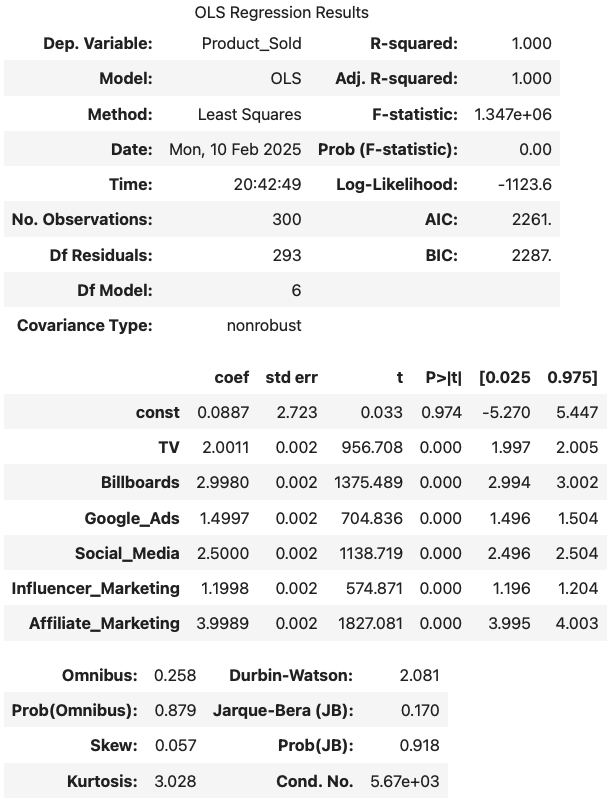

# **Optimizing Advertising Spend: Predictive Sales Modeling & Market Mix Analysis**

## **Project Overview**
- This project analyzes the impact of advertising spend across multiple channels on product sales. Using **Machine Learning models and statistical analysis**, we aim to **optimize budget allocation** and **predict future sales** effectively. Evaluates marketing campaigns across various channels to optimize ROI, engagement, and conversion rates. Using data-driven insights, we aim to enhance budget allocation, audience targeting, and campaign effectiveness.

## **Project Goals**
- Identify **key advertising channels** that drive the most sales.
- Use **Market Mix Modeling (MMM)** to optimize advertising budget allocation.
- Develop **predictive models** using **XGBoost, LightGBM, and CatBoost**.
- Utilize **SHAP analysis** to interpret model decisions and advertising impact.
- Provide actionable insights to improve marketing efficiency.
- **Campaign Effectiveness:** Analyze **conversion rates, ROI, and acquisition costs** to identify top-performing campaigns.  
- **Audience Segmentation:** Discover **high-engagement customer segments** for targeted marketing.  
- **Channel Performance:** Compare channels based on **conversion, engagement, and duration impact**.  
- **Geographical & Language Insights:** Assess **regional and linguistic factors** affecting success.  
- **Engagement & Temporal Trends:** Examine **clicks, impressions, and seasonal trends** for optimization.  
- **Cross-Analysis:** Investigate correlations like **ROI vs. engagement** and **conversion rate vs. acquisition cost**.

## **Dataset Overview**
- **File Name:** `Advertising_Data.csv`
- **Rows:** 300
- **Columns:**
  - TV Advertising Cost
  - Billboard Advertising Cost
  - Google Ads Cost
  - Social Media Spend
  - Influencer Marketing Spend
  - Affiliate Marketing Spend
  - **Product_Sold (Target Variable)**
- **Purpose:** Understanding the impact of advertising spend on sales.
  
- **File Name:** : `marketing_campaign_dataset.csv`
- **Rows:** 200,000  
- **Columns:**  
  - **Campaign Details:** Company, Campaign Type, Duration, Channels Used  
  - **Performance Metrics:** Conversion Rate, Acquisition Cost, ROI, Clicks, Impressions, Engagement Score  
  - **Audience Insights:** Target Audience, Customer Segment, Location, Language  
  - **Temporal Data:** Date
- **Purpose:** This dataset provides comprehensive insights to refine marketing strategies and improve campaign success.  

## **Results & Key Insights**
- **Affiliate Marketing, Billboards, and Social Media drive the most sales.**  
- **Influencer Marketing has minimal impact and may not be an effective budget allocation.**  
- **CatBoost is the best predictive model for accurate sales forecasting.**  
- **Market Mix Modeling suggests redistributing budget towards high-impact channels.**

## **How to Use This Project**
1. **Data Preparation:** Load `Advertising_Data.csv` into a Pandas DataFrame.
2. **Run EDA & Feature Importance Analysis** using `seaborn` & `SHAP`.
3. **Train Machine Learning models** to predict `Product_Sold`.
4. **Interpret feature importance** and adjust marketing strategies accordingly.

## **Technologies Used**
- Python (pandas, numpy, matplotlib, seaborn, sklearn, statsmodels, shap)
- **Machine Learning Models:** XGBoost, LightGBM, CatBoost, Random Forest, Gradient Boosting
- **Statistical Modeling:** Multiple Linear Regression (MMM)

## **Contributors**
- **Project Owner:** Jeeva Saravana Bhavanandam
  
## **More on Key Analysis & Methods**
### **1. Exploratory Data Analysis (EDA)**
- Data cleaning, summary statistics, and correlation heatmaps.
- Feature distribution analysis and scatter plots to detect trends.

- Spending is **evenly spread** across all advertising channels, but some **high-value outliers** exist.  
- **A few extreme values** in different platforms might represent **expensive campaigns** that need analysis.  
- The spread of data shows **some channels have a wider variance** in spending than others.

- **TV (17.41%) & Google Ads (17.24%)** get the highest budget, indicating priority.
- **Billboards (16.91%) & Social Media (16.48%)** receive balanced spending across traditional & digital ads.
- **Affiliate (16.30%) & Influencer Marketing (15.67%)** have the lowest share, suggesting cost-efficiency or lower priority.

 - **Affiliate Marketing & TV** show the strongest positive correlation with sales.  
- Other channels like **Billboards, Google Ads, and Social Media** also have slight upward trends. 
- The **black regression line** shows the general trend of how sales increase with ad spend.  
- **Steeper slopes indicate stronger impact** on `Product_Sold`.

- The histogram shows **product sales follow a near-normal distribution**, with most values between **6000-9000 units**.  

### **2. Feature Importance (SHAP Analysis)**

**Feature Importance (Random Forest)**
- **Affiliate Marketing** is the most influential factor, driving the highest impact on sales.
- **Billboards and Social Media** also have significant effects, meaning traditional and digital advertising both play key roles.
- **TV and Google Ads** contribute moderately to sales but are not the primary drivers.
- **Influencer Marketing** has the least impact, suggesting it may not be an effective use of the budget.

**SHAP Beeswarm Plot**
- **Higher values of Affiliate Marketing spending strongly increase sales**, confirming its importance.
- **Billboards and Social Media have mixed effects**, where spending more does not always guarantee higher sales.
- **TV Ads and Google Ads show diminishing returns**, indicating that past a certain point, increasing spend does not significantly boost sales.
- **Influencer Marketing has mostly negative or low impact**, meaning increasing its budget may not lead to better results.

### **3. Market Mix Modeling (MMM)**

- Built a **Multiple Linear Regression model** to analyze ROI on advertising spend.
- Found optimal budget allocations for different ad platforms.
    

- The Multiple Linear Regression Model estimates how each advertising channel contributes to Product Sold:

**Key Results:**  

- Affiliate Marketing (coef: ~3.99) → Highest impact on sales.
- Billboards (coef: ~2.99) → Significant effect on product sales.
- Social Media (coef: ~2.50) → Contributes well to sales.
- TV (coef: ~2.00) → Moderate impact on sales.
- Google Ads (coef: ~1.50) → Lower impact than expected.
- Influencer Marketing (coef: ~1.20) → Least effective channel.

### **4. Predictive Sales Modeling**
Trained multiple **Machine Learning models** with **hyperparameter tuning** to predict sales:
- **Best Performing Model:** **CatBoost (R² = 0.9447, RMSE = 397.9)**
- Other strong models: **LightGBM, Gradient Boosting, and XGBoost.**
- **Linear Regression showed overfitting, and Support Vector Regression performed poorly.**

| Model                  | MAE         | RMSE       | R² Score  |
|------------------------|-------------|------------|-----------|
| Linear Regression      | 7.085374    | 8.681355   | 0.999974  |
| Ridge Regression      | 7.085554    | 8.681603   | 0.999974  |
| Random Forest         | 500.784333  | 647.999283 | 0.853394  |
| Gradient Boosting     | 362.596702  | 484.965222 | 0.917885  |
| Support Vector Regressor | 1315.586601 | 1625.524582| 0.077452  |
| XGBoost              | 561.516321  | 689.412414 | 0.834057  |
| LightGBM             | 353.088531  | 461.849407 | 0.925526  |
| **CatBoost** | **291.855208**  | **397.906363**  | **0.944721**  |

## Marketing Campaign Performance Analysis - Temporal Trends

  

